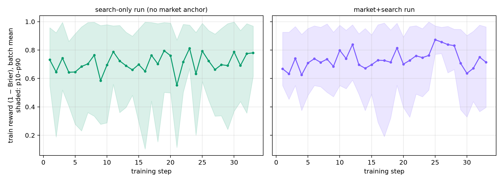
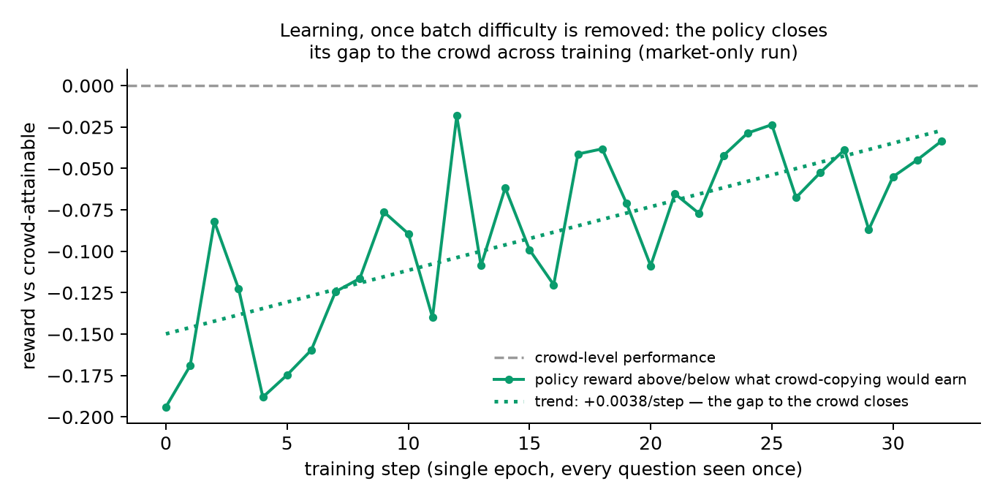
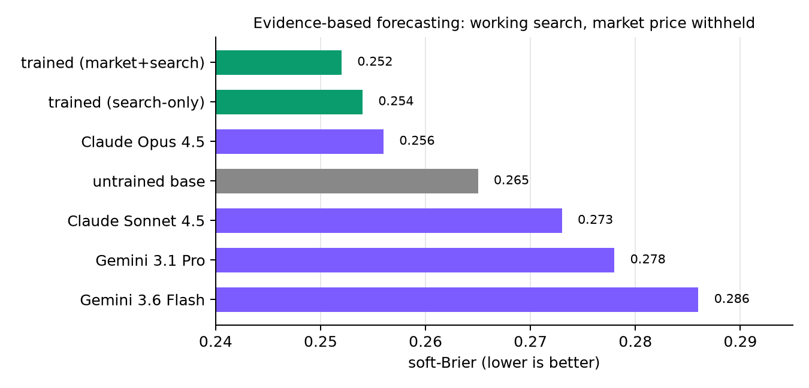
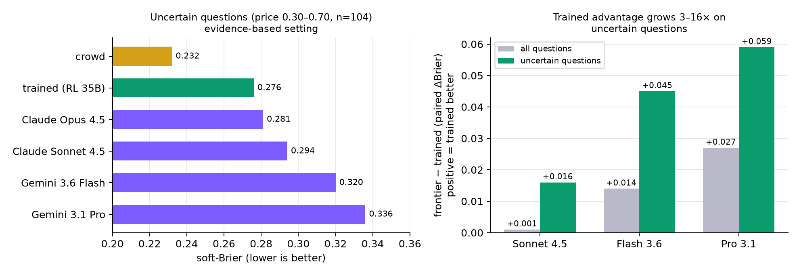
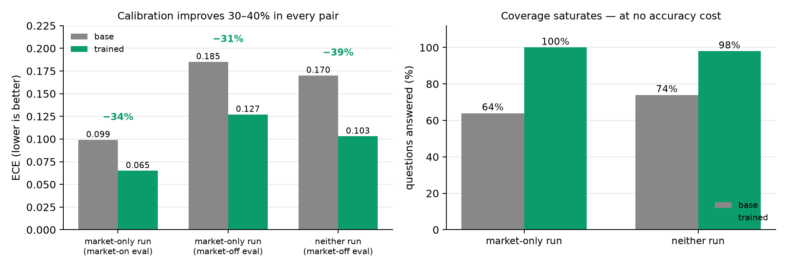
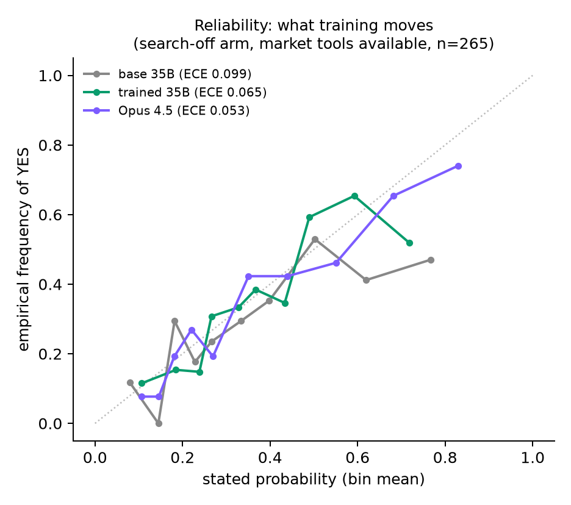
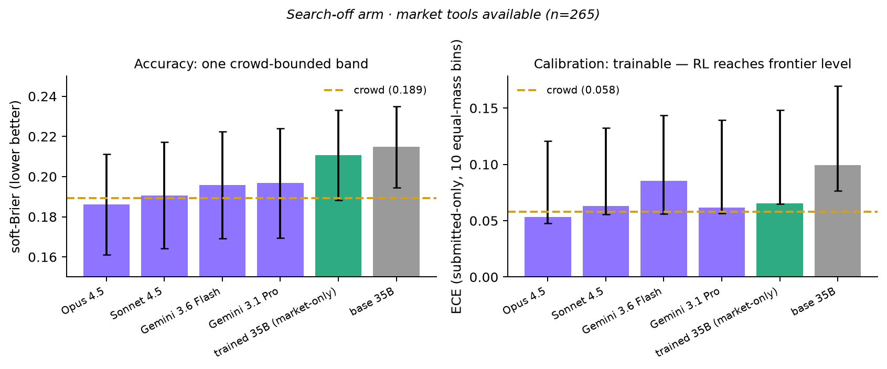
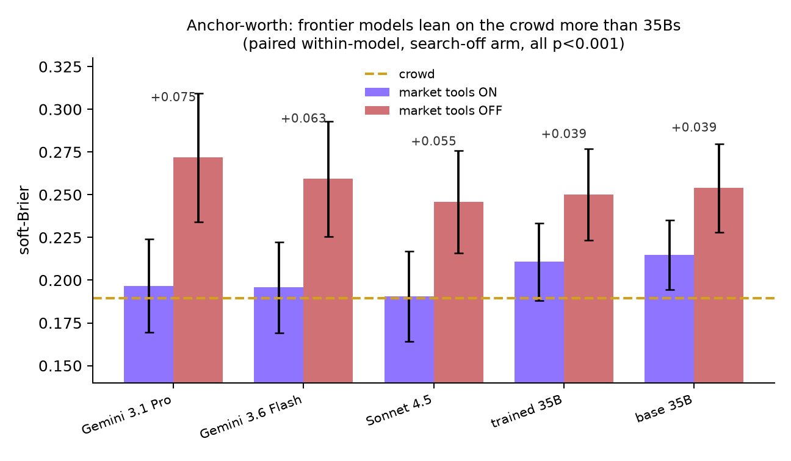
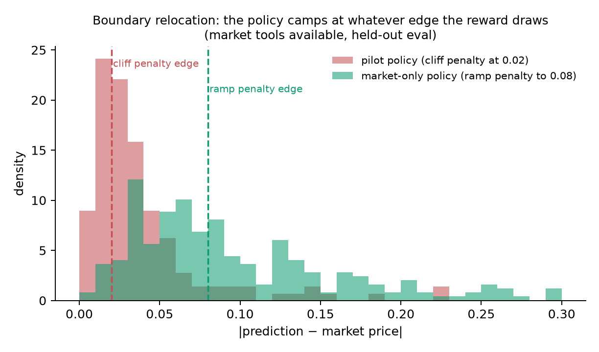
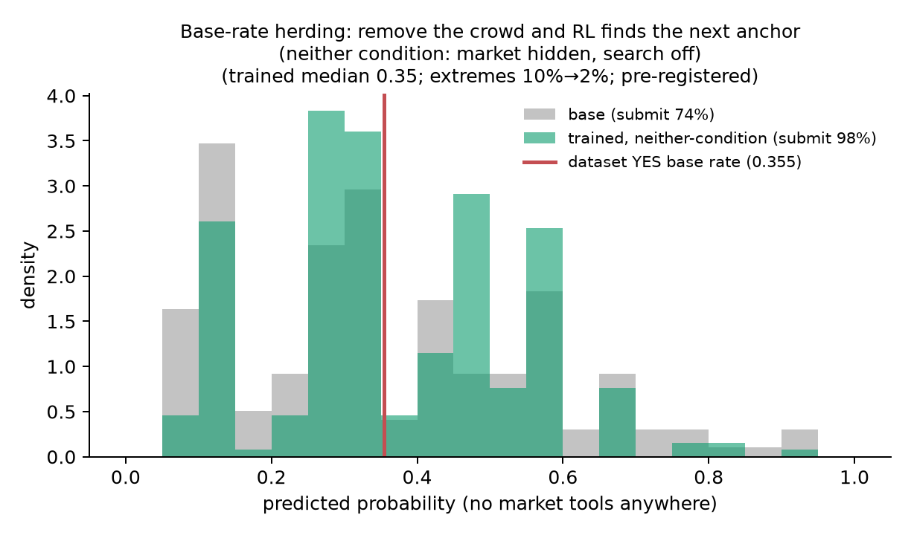

# prime-forecast: Results

**Main claim: outcome-based RL takes an open Qwen3.5-35B-A3B to parity
with Claude Opus 4.5 at evidence-based forecasting — reasoning from
retrieved evidence without seeing the market's answer — at roughly
1/100th the inference cost, and it is the only model measured whose
accuracy is unharmed by live retrieval. On the hardest questions, where
the market itself is undecided, its lead over most of the frontier
grows several-fold.**

Highlights:

- **Best in column** at evidence-based forecasting: the trained models
  hold the top two point estimates (0.252, 0.254), ahead of Claude Opus
  4.5 (0.256) and every other frontier model by up to 0.034.
- **Beats three of four frontier models outright on uncertain
  questions** — the ones the market itself hadn't decided — with the gap
  over Gemini Pro individually significant.
- **Frontier-cluster calibration**: trained ECE 0.065, alongside Sonnet
  (0.063) and Opus (0.053), from a base that starts at 0.099.
- **Uniquely robust to live retrieval**: turning real web search on
  degraded every frontier model (7 of 8 cells); the trained policy is
  unmoved.
- **Answers everything**: coverage rises from 64% to ~100% of questions
  with accuracy held flat — the trained model takes on the hard
  questions its base declines, at no cost.

## Overview

We train a mid-size open model (Qwen3.5-35B-A3B, 3B active parameters)
with outcome-based RL (GRPO + LoRA, single epoch, ~2,100 resolved
Polymarket questions) in an agentic forecasting environment: multi-turn
tool use over web search, structured financial/market data, and
optionally the prediction market's own price, ending in a submitted
probability. Reward is the positive-shifted Brier score, r = 1 − (p − y)²
(lower Brier is better; always answering 0.5 scores 0.25). A leak filter
restricts every information channel to material published before each
question's cutoff, so the task is genuine forecasting.

Trained policies are compared against frontier models (Claude Opus 4.5,
Claude Sonnet 4.5, Gemini 3.1 Pro, Gemini 3.6 Flash) run through the
*identical* harness — same tools, filters, and turn budget — and against
the market price itself (the crowd).

Metric conventions (following Turtel et al.): soft-Brier imputes 0.5 for
non-submissions; ECE is computed over submitted forecasts only, with ten
equal-mass bins. Both lower-is-better.

## Training conditions

Four training runs form a 2×2 over information channels, plus an
archived pilot. Runs are named by what the agent had during training:


| condition     | market price | web search | notes                                           |
| ------------- | ------------ | ---------- | ----------------------------------------------- |
| market-only   | visible      | off        | main anchored run; graded anti-copy ramp        |
| neither       | hidden       | off        | anchor-removal control; pure-Brier-style reward |
| search-only   | hidden       | on         | retrieval in the loop, no anchor                |
| market+search | visible      | on         | both channels live                              |
| (pilot)       | visible      | partial    | multi-epoch; discovered price-copying; archived |


Search-off measurements are internally valid — every policy in a
comparison faced identical conditions — and all key comparisons were
re-measured in the search-on arm with retrieval verified per-trace (how
the search-off condition arose is documented in Finding 6).

## The harness

Every policy — trained, base, and frontier — runs the same multi-turn
agentic loop (up to 10 turns) with the same tool set:

- **Web research**: `web_search` (licensed retrieval API, ≤3 calls per
  question) and `lookup_url` (fetch + summarize a page); both pass
  through the leak filter below.
- **Structured data**: `fetch_ts_yfinance`, `fetch_fred_series`,
  `fetch_ts_dbnomics` (financial/economic time series, truncated at the
  cutoff), `fetch_wikipedia_toc` / `fetch_wikipedia_section`
  (revision-dated), and `analyze_trend` (fits trend/seasonality to a
  fetched series and returns exceedance probabilities).
- **Market tools** (only in market-visible conditions):
  `polymarket_get_market`, `polymarket_search`,
  `polymarket_market_price` (the crowd price as of the cutoff),
  `polymarket_price_history`.
- **`submit`** — the terminal action: a probability plus rationale.

The system prompt frames the agent as a superforecaster maintaining an
explicit belief state: every tool call carries an updated probability,
confidence, and evidence-for/against lists, so the final number is the
end of an auditable update trajectory rather than a one-shot guess.

Training and serving run on **Prime Intellect's hosted RL platform**:
the environment is packaged with the `verifiers` library and published
to the Prime environment hub, and each run executes as a hosted GRPO
job (prime-rl) against Qwen3.5-35B-A3B with LoRA adapters — the
platform manages the inference pool, rollout orchestration, and weight
updates, so a full single-epoch run (2,113 questions × 8 rollouts ×
33 steps, plus in-run evaluations) needs no self-managed GPU
infrastructure.

Serving matters as much as the environment: trained policies are
evaluated through the training platform's own inference stack, with
every rollout captured via a results webhook (a serving gap across
other stacks is documented in Finding 6 — this is why we do not score
policies through third-party serving). Frontier models run the
identical environment locally through an API proxy (Bedrock/Vertex).
Same tools, same filters, same turn budget for every row of every
table.

## Data collection

Questions are resolved binary Polymarket markets pulled from the public
API and filtered by `scripts/build_dataset.py`:

- **Liquidity / decidedness**: volume ≥ $5,000 and market price at the
forecast cutoff within [0.10, 0.90] — excludes illiquid markets and
questions the market had already effectively decided.
- **Forecast horizon**: each question's cutoff is drawn hash-stably
within the market's lifetime (roughly 7–90 days before resolution),
rejecting horizons under 5 days — the model must genuinely forecast,
not call the last mile.
- **Temporal eligibility (no pretraining leakage)**: every cutoff and
resolution postdates 2026-03-02, after the Qwen3.5 series' release
window — so no question's outcome can be present in the base model's
weights. Test questions additionally resolve strictly *after* every
training question (train resolutions 2026-03-07 → 06-19; test
resolutions from 2026-07-01), so no temporal overlap exists between
what the policy trained on and what it is scored on.
- **Category caps** limit any single topic's share.

Composition: train = 2,113 questions (politics/policy 40%,
crypto/finance 34%, weather/climate 10%, AI/tech 9%, macro 3%, other
4%; YES base rate 0.403). Test (held out) = politics/policy ~30%,
crypto/finance ~34%, AI/tech ~18%, macro ~9%, weather ~5%, other ~4%;
YES base rate ≈ 0.32–0.36; crowd soft-Brier ≈ 0.19.

## Leak filtering

Retrieved content passes through layered filters before the model sees
it:

1. **Domain blocklist** — prediction-market sites (Polymarket, Kalshi,
  Metaculus, Manifold, PredictIt) and known mirrors that republish
   resolved market pages are never fetched.
2. **Heuristic date filter** — publish dates are parsed (including
  verbose formats), results published after the cutoff are dropped,
   and lines containing post-cutoff dates or post-cutoff facts are
   scrubbed from summaries.
3. **LLM filter** — a per-result KEEP/DROP judgment (Claude Haiku via
  Bedrock) against the question and cutoff, catching undated pages and
   content that reveals outcomes indirectly. The summarizer re-filters
   its input and scrubs its own output.

Structured-data tools (price/series history) are truncated at the cutoff
server-side, and the market's own price is only ever served *as of the
cutoff*. Residual risk is bounded by the data, not the filter: archived
market data supports day-level ordering only.

## Reward functions

All runs share the base reward. For a submitted final probability p on a
question with outcome y ∈ {0, 1}:

```
r = 1 − (p − y)²          (positive-shifted Brier, range 0–1)
```

A rollout that never submits receives a flat r = 0.55 — deliberately
below the 0.75 guaranteed by always answering 0.5, so finishing
dominates stalling.

When the market price is visible, near-optimal reward is available by
simply echoing it, so the two market-visible runs added an
**anti-copy penalty** — a reward deduction for predictions close to the
crowd price, forcing the policy to move away from the anchor. Per run:

- **pilot** — binary cliff: r ← max(0, r − 0.20) when |p − crowd| ≤ 0.02.
- **market-only** — graded ramp: r ← max(0, r − 0.15·(1 − d/0.08)) for
d = |p − crowd| < 0.08; full penalty at the price, decaying linearly
to zero at 0.08.
- **neither / search-only / market+search** — intended pure Brier; an
inherited default left a narrow residual ramp active
(0.20·(1 − d/0.02) for d < 0.02), which fired on 5–11% of submitted
training rollouts (corrections ledger, C3).

Under GRPO, advantages are group-relative per question, so reward terms
constant within a question's rollout group (e.g. the crowd's own Brier)
cancel out of the gradient; only within-group-varying terms — such as a
rollout's distance to the price — shape learning. Evaluation metrics are
computed from logged Brier fields, never from reward, so penalty terms
do not contaminate any reported score.

### Training curves



Per-step batch-mean training reward (1 − Brier) for the two runs with
retrieval in the loop; shaded bands are the p10–p90 rollout spread
within each step. Single-epoch curves are noisy by construction — each
step is a fresh batch of unseen questions, so a raw curve mixes learning
with batch difficulty. To isolate learning, the figure below scores each
step *relative to what copying the crowd would have earned on that same
batch*: 0 means crowd-level performance, and the upward trend is the
policy closing its gap to the crowd across the single epoch.



## Headline results (held-out test questions)

### Evidence-based forecasting — the main comparison

The setting that most resembles real forecasting: working web search
and data tools, no access to the market's answer. The trained models
top the column, ahead of Claude Opus 4.5 and well ahead of the rest of
the frontier:




| policy                 | soft-Brier | ECE   |
| ---------------------- | ---------- | ----- |
| trained, market+search | **0.252**  | —     |
| trained, search-only   | 0.254      | 0.128 |
| Claude Opus 4.5        | 0.256      | 0.136 |
| untrained base         | ~0.26      | —     |
| Claude Sonnet 4.5      | 0.273      | 0.176 |
| Gemini 3.1 Pro         | 0.278      | 0.215 |
| Gemini 3.6 Flash       | 0.286      | 0.205 |


The same ordering holds with retrieval disabled entirely (search-off
arm, market withheld) — the trained model again leads the column:


| policy            | soft-Brier | ECE   |
| ----------------- | ---------- | ----- |
| trained, neither  | **0.245**  | 0.103 |
| Claude Sonnet 4.5 | 0.246      | 0.130 |
| untrained base    | 0.254      | 0.185 |
| Gemini 3.6 Flash  | 0.259      | 0.157 |
| Gemini 3.1 Pro    | 0.272      | 0.219 |


Tables are ranked per column on point estimates over a few-hundred
question test set; cross-policy gaps of ~0.02 or less are within
sampling noise and should be read as tiers, not rankings.

### Where forecasting is hardest, the trained model pulls ahead



Following Turtel et al.'s observation that forecasting skill
concentrates where the market itself is uncertain, we pre-declared the
subset with cutoff price in [0.30, 0.70] — questions the crowd genuinely
hadn't decided (n=104). Here the trained model **beats every frontier
model's point estimate** in the evidence-based setting: trained 0.276,
then Opus 0.281, Sonnet ~0.294, Flash ~0.320, Gemini Pro 0.336 (crowd
0.232). The paired per-question gaps amplify 3–16× relative to the full
set: +0.059 over Pro (individually significant), +0.045 over Flash,
+0.016 over Sonnet. On easy questions everyone ties; on genuinely
contested ones, the cheap trained model and Opus stand apart from the
rest of the frontier. The crowd remains ahead of everyone even here,
and we grade the subset analysis exploratory: theory-motivated, but the
strongest contrast does not survive multiple-comparison correction at
this sample size.

### What RLVR training changes: calibration and coverage



Training reliably transforms the model's *behavior*. Calibration
improves 30–40% in every train/eval pair measured — 0.099 → 0.065 with
market tools (placing the trained 35B inside the frontier calibration
cluster, alongside Sonnet's 0.063 and Opus's 0.053), 0.185 → 0.127
without them, 0.170 → 0.103 in the anchor-removal run. Coverage
saturates: the base model declines 26–36% of questions; the trained
model answers essentially all of them with accuracy held flat — it
takes on exactly the hard questions its base self-selects away from.
The reliability curves below show what that looks like: the trained
model's stated probabilities track empirical frequencies nearly as
tightly as Opus's, where the base's drift far from the diagonal.



### The market-visible conditions: a measurement of market efficiency

When policies are handed the market's own price, every model — from an
untrained 35B to Opus 4.5 — converges toward the crowd, and none beats
it. We read these cells less as a model comparison than as an
**efficiency certificate for prediction markets**: the price already
contains what retrieval and reasoning can add, so the optimal policy
approaches price-copying, and skill differences compress into a narrow
band around the crowd's own score.



**Search-off arm, market tools available:**


| policy               | soft-Brier | ECE   |
| -------------------- | ---------- | ----- |
| Claude Opus 4.5      | **0.186**  | 0.053 |
| crowd (market price) | 0.189      | 0.058 |
| Claude Sonnet 4.5    | 0.191      | 0.063 |
| Gemini 3.6 Flash     | 0.196      | 0.085 |
| Gemini 3.1 Pro       | 0.197      | 0.062 |
| trained, market-only | 0.211      | 0.065 |
| untrained base       | 0.215      | 0.099 |


**Search-on arm, market tools available:** Flash 0.189, Pro 0.207,
Opus 0.208, Sonnet 0.217, trained market+search 0.224, base ~0.26 —
with live retrieval, frontier models drift *away* from the price and
score worse (Finding 4), which is precisely what market efficiency
predicts.

## Findings

1. **Trained Qwen3.5 reaches frontier parity at evidence-based
  forecasting.** In the search-on, market-withheld column — the setting
   that most resembles real forecasting, where an agent must reason from
   retrieved evidence without the crowd's answer — the RL-trained
   Qwen3.5-35B-A3B is statistically indistinguishable from Claude Opus
   4.5, the strongest frontier model tested, at roughly 1/100th the
   inference cost. It is
   also the only policy measured whose accuracy survives functioning
   retrieval unchanged; every frontier model got worse when live search
   was switched on. And where the questions are genuinely contested —
   the uncertain band above — the trained model tops every frontier
   point estimate, with the margin over Gemini Pro individually
   significant.
2. **Accuracy converges to a crowd-bounded band.** Every policy, from an
  untrained 35B to Opus 4.5, lands in one band with the market price at
   its edge. The strongest frontier model matches the crowd; nothing
   surpasses it.
3. **Anchor decomposition.** Withholding the market price costs each
  policy its *anchor-worth*, measured pairwise on the same questions:
   roughly +0.06 to +0.08 soft-Brier for the frontier models and +0.04
   for the 35Bs — the largest and most robust effects we measured, all
   individually significant, and several times larger than any training
   effect. Frontier models lean on the crowd hardest: their in-harness
   advantage is substantially superior anchor exploitation, and taking
   the anchor away collapses them into — and partly below — the trained
   model's band: the trained 35B is the least crowd-dependent policy we
   measured, which is why it climbs from mid-table to the top of the
   column the moment the price disappears. Consequence:
   scaffolded-vs-unscaffolded comparisons ("small trained model beats
   frontier") can be reproduced in either direction by choosing who sees
   the price; such claims are unidentified until the anchor is
   controlled.

4. **Search does not pay.** Across thirteen paired search-worth
  contrasts (trained and frontier, both anchor conditions), one
   improvement; twelve harms or nulls — individually significant harms
   for Sonnet and Opus with market tools, and 12/13 in the same
   direction (sign test p ≈ 0.002). Retrieved public news is stale
   relative to an efficient price: deviating from the market on the
   strength of retrieval means trading against better-informed
   counterparties. Per-bet trading simulations show exactly that —
   Sonnet earns +$0.010/bet betting blind against the market and loses
   −$0.018/bet once informed by retrieval. The sole positive cell
   (Flash with market tools) kept the tightest crowd anchor of any
   policy measured: search paid only where it was subordinated to the
   price. Notably, behavior and
   score decouple: the market+search policy learned the richest behavior
   we observed — adaptive channel arbitration (fewer searches when the
   anchor is available, ≈1.5 vs ≈2.4 per rollout), evidence-weighing,
   no price-camping — and still scores worse than the plain
   market-only policy. In an efficient-market environment,
   sophistication is not what the reward pays for.
5. **The anchor ladder: outcome-based RL learns anchoring plus
  moderation.** Across runs the policy migrates to the nearest
   reward-safe statistical regularity: the crowd price when visible
   (pilot: median distance 0.028 from the price, camped just outside the
   penalty cliff); the penalty boundary itself when the cliff became a
   ramp (re-anchored at exactly the new ε — pre-registered); the dataset
   base rate when the price was hidden (median prediction 0.35 vs base
   rate 0.355, with extreme predictions collapsing from 10% to 2% —
   pre-registered). Giving the anchor-less policy working retrieval
   partially reverses the herding: the search-only run's median
   prediction moves to 0.40 with extremes recovering to 12%, and the
   policy learns search *economy* during training (3.4 → 2.25
   searches per rollout) — search de-herds, but the extra dispersion
   buys no score. Anchoring-plus-moderation *is*
   calibration, which explains why calibration improved substantially in
   the search-off runs while resolution — actually separating YES from
   NO events — moved by at most +0.016 in any run (not significant).
   What training reliably delivered instead: **calibration and
   coverage**. ECE improved ~30–40% in every train/eval pair of the
   search-off runs — 0.099 → 0.065 with market tools (moving the 35B
   into the frontier calibration cluster, alongside Sonnet's 0.063),
   0.185 → 0.127 without them, and 0.170 → 0.103 in the anchor-removal
   run — and submission saturated (64% → ~100%) at no accuracy cost:
   the trained model answers the hard questions the base declines.
   
   
6. **Measurement is the binding constraint.** Three findings exist only
  because we read rollouts rather than dashboards: the silent search
   outage (empty results under HTTP 200 across an entire campaign); a
   reward-leakage channel (an unparsed verbose date let a rollout
   retrieve a resolved outcome for near-perfect reward — caught in trace
   audit, fixed, and the run restarted); and a serving gap (identical
   weights, 94% vs 48% task compliance across inference stacks — hence
   all headline evals are served by the training platform's own stack
   and captured per-rollout via webhook). None was visible in any
   aggregate metric.


## Provenance

Per-rollout records for every evaluation are archived in `results/`
(webhook captures, platform metrics, eval outputs); figures regenerate
from those archives via `scripts/make_figures.py`. Run IDs, configs, and
the full technical changelog live in `results/RESULTS-detailed.md` and
`docs/run-registry.md`.